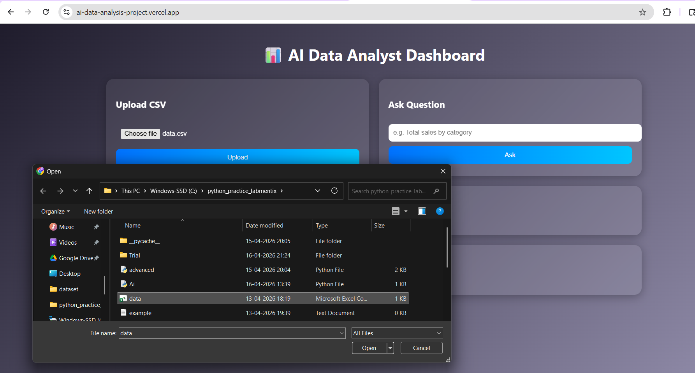
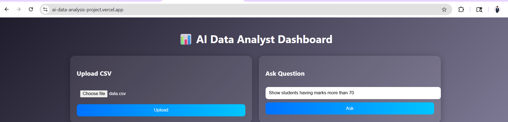
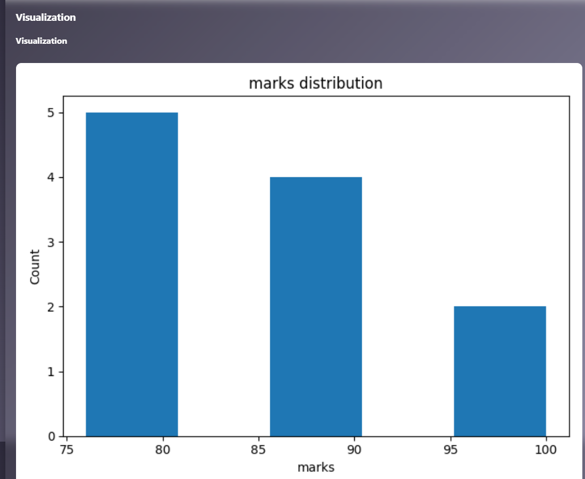

# 📊 AI Data Analysis Dashboard

An AI-powered web application that allows users to upload CSV files, ask questions in natural language, and get instant analysis with visualizations.

---

## 🚀 Live Demo

🔗 Frontend: https://ai-data-analysis-project.vercel.app  
🔗 Backend: https://ai-data-analysis-project.onrender.com

---

## 🛠️ Tech Stack

- **Frontend:** HTML, CSS, JavaScript
- **Backend:** FastAPI (Python)
- **Data Processing:** Pandas, NumPy
- **Visualization:** Matplotlib
- **AI Integration:** OpenAI API
- **Deployment:** Vercel (Frontend), Render (Backend)

---

## 🔥 Features

- 📂 Upload CSV files
- 🤖 Ask questions in plain English
- 📊 Automatic data analysis
- 📈 Chart generation (Bar, Pie, Histogram)
- ⚡ Fast API response
- 🌐 Fully deployed web app

---

## 📸 Screenshots

### 🔹 Upload CSV


### 🔹 Ask Question


### 🔹 Result Output


### 🔹 Visualization


---

## ⚙️ How It Works

1. User uploads a CSV file  
2. AI converts the question into pandas code  
3. Backend executes the code on dataset  
4. Result is returned as table/data  
5. Charts are generated automatically  

---

## ▶️ Run Locally

```bash
git clone https://github.com/YOUR_USERNAME/Ai-data-analysis-Project.git
cd backend
pip install -r requirements.txt
uvicorn main:app --reload